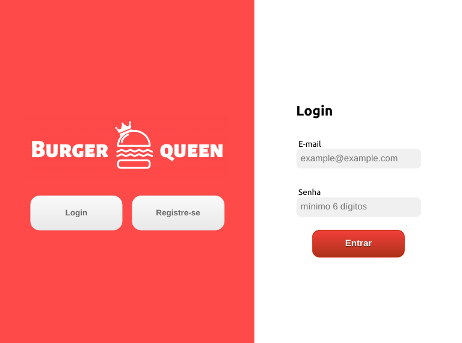
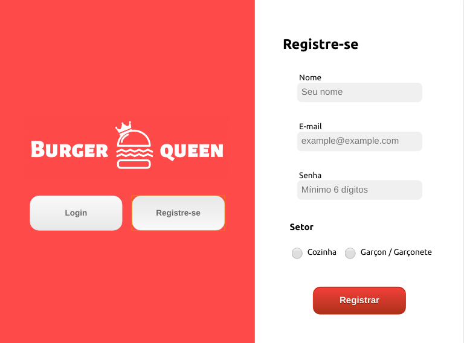
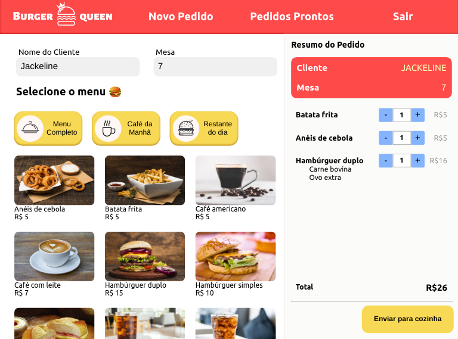
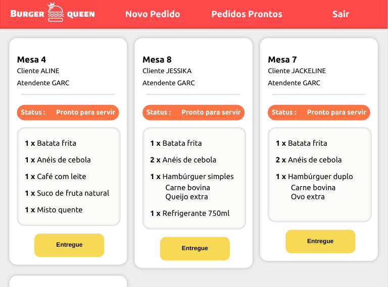
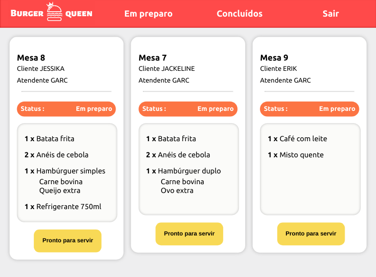
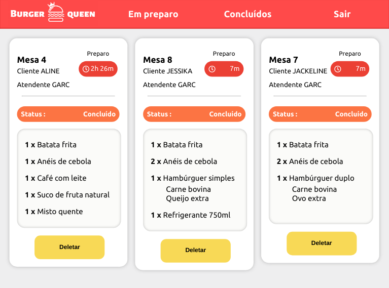

# Burger Queen

## Índice

* [1. Burger Queen](#1-burger-queen)
* [2. Resumo do projeto](#2-resumo-do-projeto)
* [3. Uso e tecnologias implementadas](#3-uso-e-tecnologias-implementadas)
* [4. Interface](#4-interface)
* [5. Considerações finais](#5-considerações-finais)

***

## 1. Burger Queen

O projeto Burger Queen foi criado 100% por demanda do usuário. O usuário é um restaurante que necessita de uma interface em que se possa realizar pedidos utilizando um tablet, e enviá-los para a cozinha para que sejam preparados de forma ordenada e eficiente.

## 2. Resumo do projeto

Neste projeto nos foram apresentadas 4 Histórias de usuários:

#### [História de usuário 1] Garçon deve poder anotar o seu pedido

Eu como garçon devo poder anotar o pedido, saber o valor de cada 
produto e poder enviar o pedido para a cozinha para ser preparado.

##### Critérios de aceitação

* Anotar o nome e mesa.
* Adicionar produtos aos pedidos.
* Excluir produtos.
* Ver resumo e o total da compra.
* Enviar o pedido para a cozinha (guardar em algum banco de dados).
* Funcionar bem e se adequar a um _tablet_.


#### [História de usuário 2] Chefe de cozinha deve ver os pedidos

Eu como chefe de cozinha quero ver os pedidos dos clientes em ordem, poder marcar que estão prontos e poder notificar os garçons/garçonetes que o pedido está pronto para ser entregue ao cliente.

##### Critérios de aceitação

* Ver os pedidos à medida em que são feitos.
* Marcar os pedidos que foram preparados e estão prontos para serem servidos.
* Ver o tempo que levou para preparar o pedido desde que chegou, até ser marcado como concluído.

#### [História de usuário 3] Garçom/Garçonete deve ver os pedidos prontos para servir

Eu como garçom/garçonete quero ver os pedidos que estão prontos para entregá-los rapidamente aos clientes.

##### Critérios de aceitação

* Ver a lista de pedidos prontos para servir.
* Marque os pedidos que foram entregues.

#### [História de usuário 4] Usuário deve ter seu perfil (login/senha) para acessar o sistema.

Eu como funcionário do restaurante quero entrar na plataforma e ver apenas a tela importante para o meu trabalho.

##### Critérios de aceitação

* Criar login e senha.
* Criar tipo de usuário (cozinha / salão).
* Entrar na tela correta para cada usuário.


## 3. Uso e tecnologias implementadas

Para utilizar esta aplicação você pode ir direto neste link [Burger Queen](https://burger-queen-jm.firebaseapp.com/) ou então dê um git clone deste repositório e no seu terminal use o comando

```
npm start
```

Este projeto foi desenvolvido usando as seguintes tecnologias e ferramentas 

* HTML5.
* JavaScript (ES6).
* CSS.
* React Hooks.
* growl-alert
* hmh
* Aphrodite
* Firebase
* @fortawesome/react-fontawesome 
 
## 4. Interface

### Página Inicial

#### Login


#### Registro



### Telas para o Garçon

#### Novo Pedido
 

 #### Prontos para entregar
 

 ### Telas para Cozinha

#### Pedidos para preparar
 

 #### Pedidos concluídos
 


## 5. Considerações finais

* Interface foi pensada específicamente para rodar em tablets, mas tem configurações para desktop.
* O aplicativo é um Single Page App.
* O projeto foi desenvolvido como parte curricular do Bootcamp Laboratória pela aluna Jackeline
